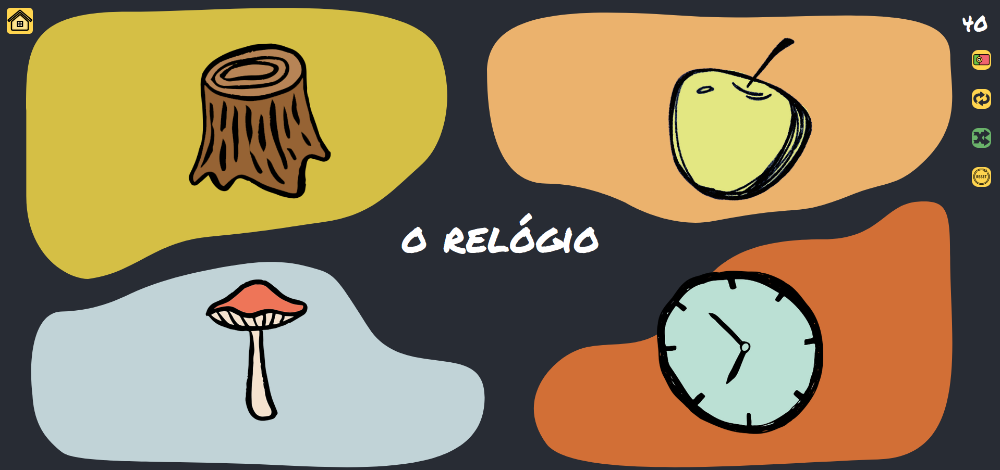

# Overview

It's a game for guessing words' meanings in different languages. For now though there are only two: English and Portuguese, but probably will be some more.
There are already similar games (like `Fast English` or `BabaDum`), but in this one I implemented new feature for repeating previously learned words (very useful when you're a learner), saving progress in local storage, resetting progress.

The game also has its own design and game mechanic. Moreover, it is open sourced, in order to let other enthusiasts extend this game or create their own versions based on this one.

In the future I'd like to add Statistics page, adapt layout for different screens, add more languages and some more.
## How does it look like:

## Technologies

The game is written using `React`, `Typescript`, `CSS modules` and `React Spring` for animations. 

To run the project use:
### `npm start`

_Majority of the pictures was taken from free Clipart source (https://icons8.com/illustrations), and some were manually drawn by me._
